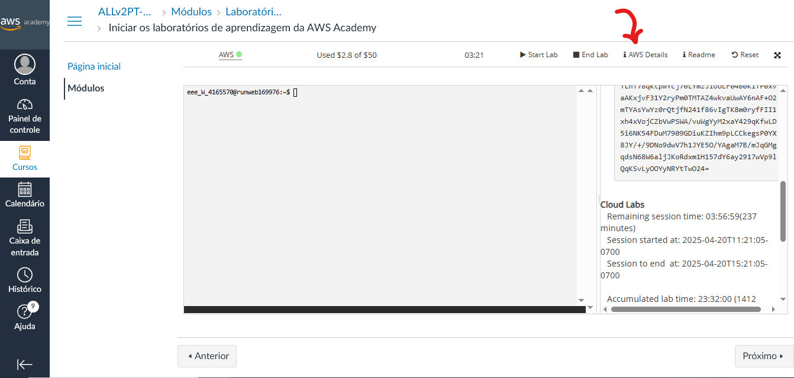
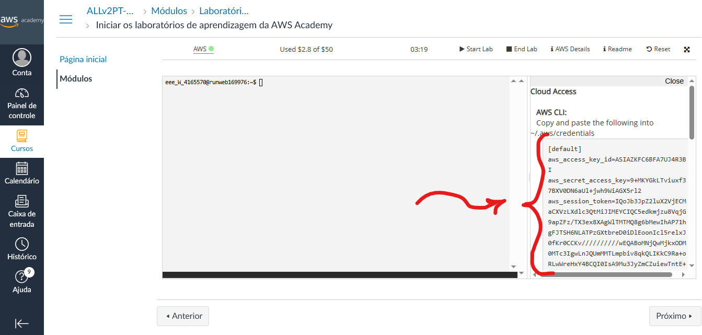
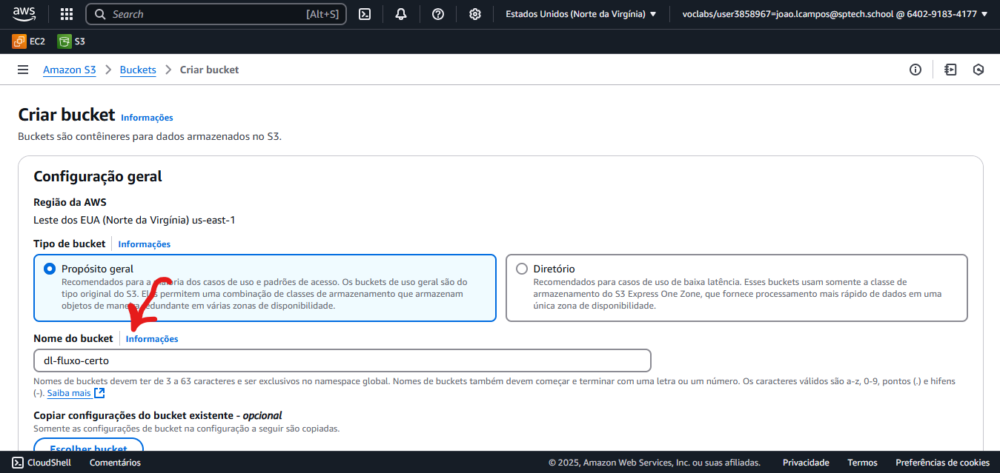
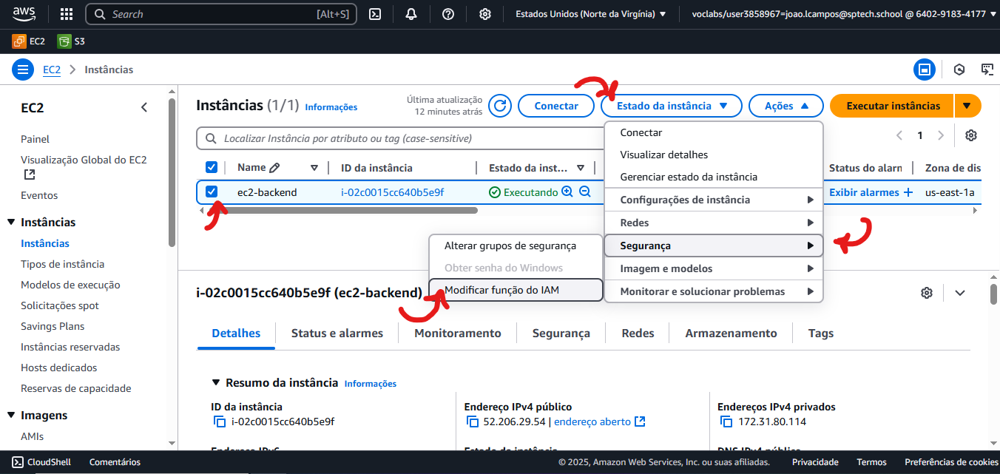
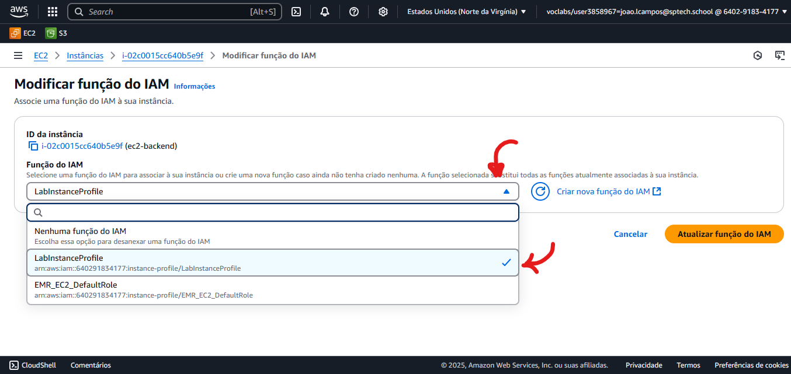

# Fluxo Certo - Script de Execução

```
                            ______ _                    _____          _        
                           |  ____| |                  / ____|        | |       
                           | |__  | |_   ___  _____   | |     ___ _ __| |_ ___  
                           |  __| | | | | \ \/ / _ \  | |    / _ \ '__| __/ _ \ 
                           | |    | | |_| |>  < (_) | | |___|  __/ |  | || (_) |
                           |_|    |_|\__,_/_/\_\___/   \_____\___|_|   \__\___/ 
                                                      
```

Este repositório faz parte do projeto **Fluxo Certo** e contém um Shell Script para facilitar a execução e inicialização do ambiente do projeto de forma automatizada.

## 📜 Sobre o Script

O objetivo deste script é:

- Automatizar o processo de inicialização do projeto Fluxo Certo
- Garantir que todas as dependências estejam instaladas corretamente
- Rodar os serviços necessários (como servidores, banco de dados, etc.)
- Fornecer uma maneira rápida e padronizada de subir o ambiente local

## 🚀 Como usar

### Pré-requisitos

Antes de executar o script, certifique-se de que você possui:

- Linux ou WSL no Windows (ambiente Unix-like)
- Permissões para executar scripts `.sh`
- Dependências básicas como: `bash`, `curl`, `git`, `docker`, etc.

---

### Passo a passo

#### 1 - Criando o repositório:

1.1 Clone este repositório:
   ```bash
   git clone https://github.com/seu-usuario/fluxo-certo-script.git
   cd fluxo-certo-script
   ```
   
1.2 Dê permissão de execução ao script:

```bash
chmod +x executar.sh
```

1.3 Execute o script:

```bash
./executar.sh
```

---

#### 2 - Configurar as variáveis de ambiente dentro da sua instância EC2:

2.1 Na tela de laboratório AWS Academy, clique em 'AWS Details':


2.2 Clique em details para exibir os tokens:


2.3 Guarde essas chaves, elas são as chaves de acesso da sua instância:


> Essas chaves atualizam toda vez que fizermos iniciarmos um novo laboratório, então, toda vez esse passo é necessário!

2.4 Acesse o bashrc da sua instância:
```bash
nano ~/.bashrc
```

2.5 Edite ele configurando as chaves de acesso:
```bash
export AWS_ACCESS_KEY_ID=ASIA...
export AWS_SECRET_ACCESS_KEY=suachavedeacesso...
export AWS_SESSION_TOKEN=suachavedeacesso...  
export AWS_DEFAULT_REGION=us-east-1  # ou outra região indicada                                       
```

2.6 Salve as alterações:

**CTRL O + Enter + CTRL X**

---

#### 3 - Criação do bucket S3

1 Crie um bucket S3 com o nome 'dl-fluxo-certo'
> **OBS: O bucket precisa ter exatamente esse nome!!!**



> As configurações do bucket são as padrões.
---

#### 4 - Função/Role na EC2

4.1 Na instância, vá em modificar a função do IAM



4.2 Selecione a opção 'LabInstanceProfile':



---

#### 5 - Configurando o acesso do S3 na instância:

5.1 Acesse as configurações

```bash
aws configure
```

5.2 Então, coloque as configurações conforme os tokens do laboratório:


---

#### 6 - Configure as credenciais do banco de dados:

6.1 Acesse o bashrc da sua instância:
```bash
nano ~/.bashrc
```

6.2 Edite ele configurando as chaves de acesso:
```bash
export DB_HOST=jdbc:mysql://localhost:3306/fluxocerto
export DB_USERNAME=admin
export DB_PASSWORD=urubu100                                     
```

6.3 Atualize o bashrc:

```bash
source ~/.bashrc
```
