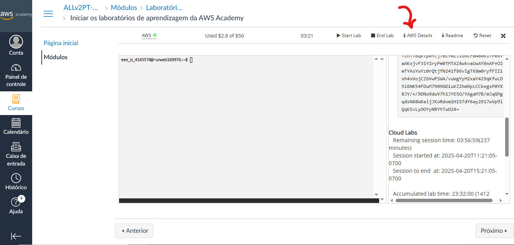
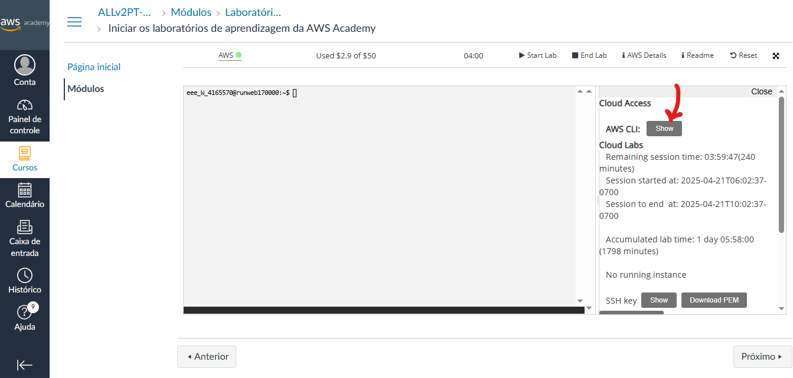
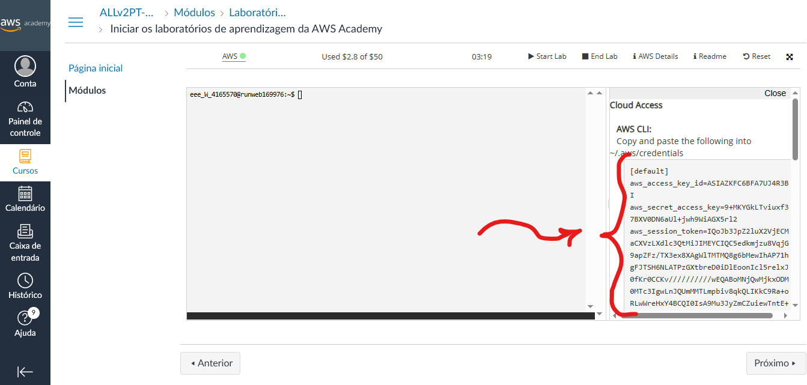
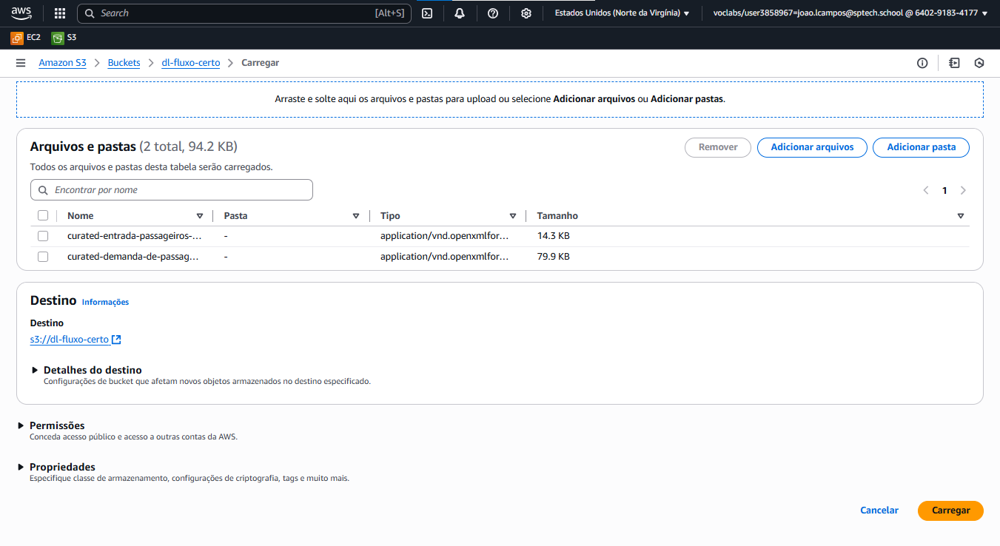

# Fluxo Certo - Script de Execução

```
                            ______ _                    _____          _        
                           |  ____| |                  / ____|        | |       
                           | |__  | |_   ___  _____   | |     ___ _ __| |_ ___  
                           |  __| | | | | \ \/ / _ \  | |    / _ \ '__| __/ _ \ 
                           | |    | | |_| |>  < (_) | | |___|  __/ |  | || (_) |
                           |_|    |_|\__,_/_/\_\___/   \_____\___|_|   \__\___/ 
                                                      
```

Este repositório faz parte do projeto **Fluxo Certo** e contém um Shell Script para facilitar a execução e inicialização do ambiente do projeto de forma automatizada.

## 📜 Sobre o Script

O objetivo deste script é:

- Automatizar o processo de inicialização do projeto Fluxo Certo
- Garantir que todas as dependências estejam instaladas corretamente
- Rodar os serviços necessários (como servidores, banco de dados, etc.)
- Fornecer uma maneira rápida e padronizada de subir o ambiente local

## 🚀 Como usar

### Pré-requisitos

Antes de executar o script, certifique-se de que você possui:

- Linux ou WSL no Windows (ambiente Unix-like)
- Permissões para executar scripts `.sh`
- Dependências básicas como: `bash`, `curl`, `git`, `docker`, etc.
- Instância com boa capacidade de armazenamento.

---

### Passo a passo

#### 1 - Criando o repositório:

**1.1** Clone este repositório:
   ```bash
   git clone https://github.com/vitorluzz/projeto_shell_fluxo_certo.git
   cd projeto_shell_fluxo_certo
   ```
   
---

#### 2 - Configurar as variáveis de ambiente dentro da sua instância EC2:

**2.1** Na tela de laboratório AWS Academy, clique em 'AWS Details':


**2.2** Clique em 'Show' para exibir os tokens:


**2.3** Guarde essas chaves, elas são as chaves de acesso da sua instância!


> Essas chaves atualizam toda vez que iniciarmos um novo laboratório, então, toda vez esse passo é necessário!

**2.4** Acesse o bashrc da sua instância:
```bash
nano ~/.bashrc
```

**2.5** Edite ele configurando as chaves de acesso:
```bash
export AWS_ACCESS_KEY_ID=ASIA...
export AWS_SECRET_ACCESS_KEY=suachavedeacesso...
export AWS_SESSION_TOKEN=suachavedeacesso...  
export AWS_DEFAULT_REGION=us-east-1  # ou outra região indicada                                       
```

**2.6** Salve as alterações:

**CTRL O + Enter + CTRL X**

---

#### 3 - Criação do bucket S3

**3.1** Crie um bucket S3 com o nome 'dl-fluxo-certo'
> **OBS: O bucket precisa ter exatamente esse nome!!!**


> As configurações do bucket são as padrões.

**3.2** Adicionando ao S3 os dados brutos:
> Os dados para adicionar estão no diretório 'arquivos' deste repositório.

Execute os comandos:

**3.3** Atualize o Sistema Operacional:
```bash
sudo apt update && sudo apt upgrade -y
```

**3.4** Instalando a ferramenta unzip:
```bash
sudo apt install unzip

```

**3.5** Instalando a ferramenta CLI:
```bash
curl "https://awscli.amazonaws.com/awscli-exe-linux-x86_64.zip" -o "awscliv2.zip"
unzip awscliv2.zip
sudo ./aws/install
```

**3.6** Upload dos arquivos para o S3:

Subindo o arquivo 1:
```bash
cd arquivos

nome_bucket="dl-fluxo-certo"

nome_arquivo1="curated-entrada-passageiros-por-linha-2020-2024.xlsx"

echo "Fazendo upload de '$nome_arquivo1' para o bucket 's3://$nome_bucket/' ..."
aws s3 cp "$nome_arquivo1" "s3://$nome_bucket/$nome_arquivo1" && \
echo "✅ Upload de '$nome_arquivo1' concluído com sucesso!" || \
echo "❌ Erro ao fazer upload de '$nome_arquivo1'."
```

Subindo o arquivo 2:
```bash
cd arquivos

nome_bucket="dl-fluxo-certo"

nome_arquivo2="curated-demanda-de-passageiros-por-estacao-2020-2024.xlsx"


echo "Fazendo upload de '$nome_arquivo2' para o bucket 's3://$nome_bucket/' ..."
aws s3 cp "$nome_arquivo2" "s3://$nome_bucket/$nome_arquivo2" && \
echo "✅ Upload de '$nome_arquivo2' concluído com sucesso!" || \
echo "❌ Erro ao fazer upload de '$nome_arquivo2'."
```
---

#### 4 - Função/Role na EC2

**4.1** Na AWS, nas seleções das instâncias, selecione a sua instâcia e vá em modificar a função do IAM:


**4.2** Selecione a opção 'LabInstanceProfile':


---

#### 5 - Configurando o acesso do S3 na instância:

**5.1** Acesse as configurações da aws dentro da sua instância:

```bash
aws configure
```

**5.2** Então, coloque as configurações conforme os tokens do laboratório:


---

#### 6 - Configure as credenciais do banco de dados:

**6.1** Acesse o bashrc da sua instância:
```bash
nano ~/.bashrc
```

**6.2** Edite ele configurando as chaves de acesso do banco de dados:
```bash
export DB_HOST=jdbc:mysql://localhost:3306/fluxocerto
export DB_USERNAME=admin
export DB_PASSWORD=urubu100                                     
```
> **Importante ser exatamente desse jeito!**

**6.3 Salve as alterações:**

**CTRL + O , ENTER , CTRL + X**

6.3 Atualize o bashrc:
```bash
source ~/.bashrc
```


---

#### 7 - Executando o Script

**7.1 Vá ao diretório principal desse projeto:**
```bash
cd ~/projeto_shell_fluxo_certo/
```

**7.2** Dê permissão de execução ao script:
```bash
chmod +x bash.sh
```

**7.3** Execute o script:
```bash
./bash.sh
```
---

#### 8 - Configurando o CRON (Agendador de Tarefas)

>Vamos agendar a execução do arquivo JAR usando o CRON, garantindo que ele seja executado periodicamente para manter a integridade dos dados.

**8.1** Acessando o crontab:
```bash
crontab –e
```

**8.2** Selecione o editor nano: (OPÇÃO 1)



**8.3** Adicionando o comando para executar o JAR de 5 em 5 minutos:
```
*/5 * * * * /usr/bin/java -jar /home/ubuntu/conexao-banco.jar
```

**8.4** Salve as alterações:

**CTRL + O , ENTER, CTRL + X**


