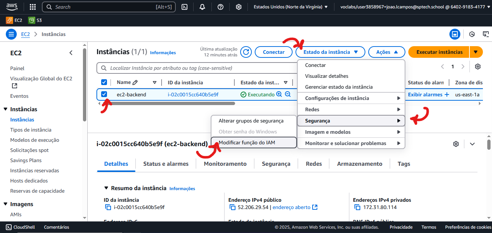
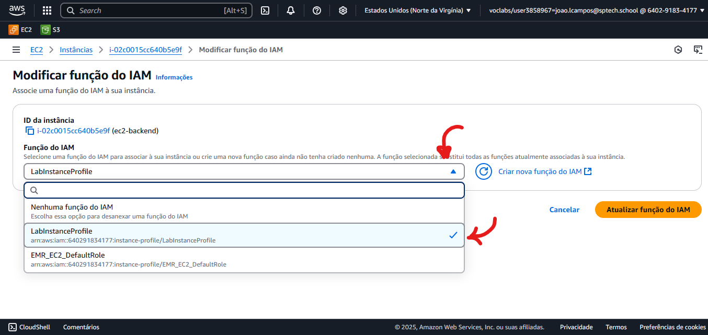
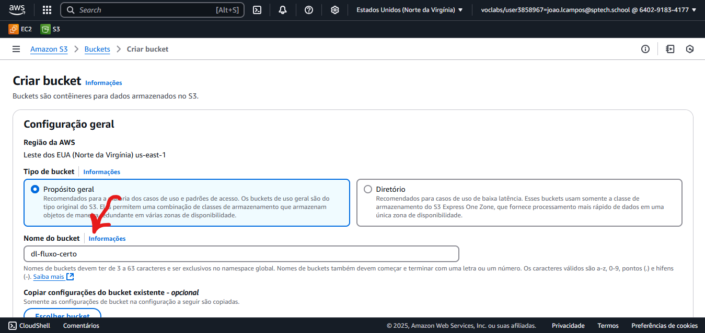
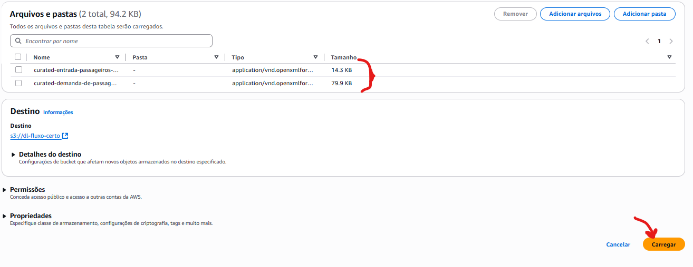
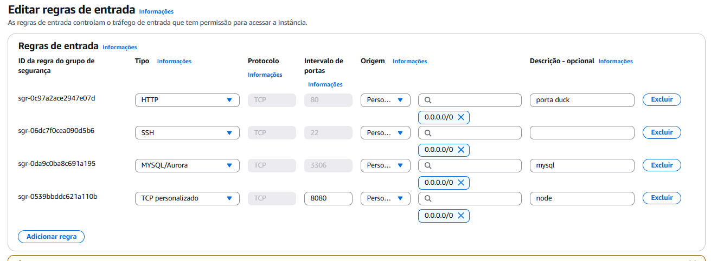
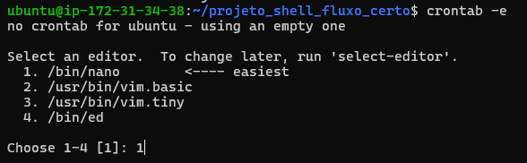

# Fluxo Certo - Script de Execução

```                                                                                

      ███████╗██╗     ██╗   ██╗██╗  ██╗ ██████╗        ██████╗███████╗██████╗ ████████╗ ██████╗
      ██╔════╝██║     ██║   ██║╚██╗██╔╝██╔═══██╗      ██╔════╝██╔════╝██╔══██╗╚══██╔══╝██╔═══██╗
      █████╗  ██║     ██║   ██║ ╚███╔╝ ██║   ██║      ██║     █████╗  ██████╔╝   ██║   ██║   ██║
      ██╔══╝  ██║     ██║   ██║ ██╔██╗ ██║   ██║      ██║     ██╔══╝  ██╔══██╗   ██║   ██║   ██║
      ██║     ███████╗╚██████╔╝██╔╝ ██╗╚██████╔╝      ╚██████╗███████╗██║  ██║   ██║   ╚██████╔╝
      ╚═╝     ╚══════╝ ╚═════╝ ╚═╝  ╚═╝ ╚═════╝        ╚═════╝╚══════╝╚═╝  ╚═╝   ╚═╝    ╚═════╝

```

Este repositório faz parte do projeto **Fluxo Certo** e contém um Shell Script para facilitar a execução e inicialização do ambiente do projeto de forma automatizada.

## 📜 Sobre o Script

O objetivo deste script é:

- Automatizar o processo de inicialização do projeto Fluxo Certo
- Garantir que todas as dependências estejam instaladas corretamente
- Rodar os serviços necessários (como servidores, banco de dados, etc.)
- Fornecer uma maneira rápida e padronizada de subir o ambiente local

## 🚀 Como usar

### Pré-requisitos

Antes de executar o script, certifique-se de que você possui:

- Máquina AWS EC2
- Ambiente Linux
- Permissões para executar scripts `.sh`
- Instância com boa capacidade de armazenamento.

---

## Passo a passo - Processo de utilização

### 1 - Criando o repositório:

**1.1** Clone este repositório:
   ```bash
   git clone https://github.com/vitorluzz/projeto_shell_fluxo_certo.git
   cd projeto_shell_fluxo_certo
   ```
   
---
### 2 - Função/Role na EC2

**2.1** Na AWS, nas seleções das instâncias, selecione a sua instâcia e vá em modificar a função do IAM:



**2.2** Selecione a opção 'LabInstanceProfile':



---

### 3 - Criação do bucket S3

**3.1** Crie um bucket S3 com o nome 'dl-fluxo-certo'
> **OBS: O bucket precisa ter exatamente esse nome!!!**



> As configurações do bucket são as padrões.

**3.2** Adicionando ao S3 os dados brutos:
> Os dados para adicionar estão no diretório 'arquivos' deste repositório.

Basta selecionar o S3 e clicar em 'Carregar', e então arrastar os arquivos para adiciona-los, depois, clique em 'Carregar':


> Após isso, temos as bases de dados brutos carregadas em nosso Data Lake.

---

### 4 - Configurando o grupo de segurança da instância:

Vamos definir algumas novas regras de entrada, para a aplicação rodar corretamente:



**Configuração de Rede e Serviços da Aplicação**

Para garantir o funcionamento correto e o acesso adequado à nossa aplicação, definimos algumas regras e configurações de portas:

- **Porta 80 (HTTP)**  
  Essa porta está configurada para o nosso DNS personalizado utilizando o serviço DuckDNS. É por meio dela que as requisições HTTP externas são roteadas para nossa aplicação.

- **SSH (porta padrão 22)**  
  O acesso via SSH está habilitado para permitir que qualquer dispositivo autorizado possa se conectar remotamente ao servidor, facilitando a administração e manutenção da aplicação.

- **MySQL (porta padrão 3306)**  
  O serviço de banco de dados MySQL está habilitado e configurado para aceitar conexões externas, garantindo que a aplicação tenha acesso ao banco para leitura e escrita dos dados.

- **Porta 8080**  
  Esta é a porta onde a nossa aplicação Node.js está rodando, recebendo as requisições HTTP internas que eventualmente são expostas externamente pela porta 80 via o DNS DuckDNS.

---

### 5 - Execução dos Scripts

Vamos dar permissão de execução para os dois scripts.

**5.1** Dando permissão de execução aos scripts:
```bash
chmod +x ambiente.sh
chmod +x etl.sh
```

**5.2** Execute o script para criação do ambiente:
```bash
./ambiente.sh
```
> Pronto, temos o java, docker, docker-compose e nossos containers contendo a aplicação node e o banco de dados mysql.


**5.3** Execute o script para execução do ETL:
```bash
./etl.sh
```

---

### 6 - Configurando o CRON (Agendador de Tarefas)

>Vamos agendar a execução do arquivo JAR usando o CRON, garantindo que ele seja executado periodicamente para manter a integridade dos dados.

**6.3** Acessando o crontab:
```bash
crontab –e
```

**6.3** Selecione o editor nano: (OPÇÃO 1)



**6.3** Adicionando o comando para executar o JAR dentro do container de 1 em 1 semana:
```
0 0 * * 0 docker exec container-java bash -c "source ~/.bashrc && java -jar /home/extracaoDados.jar"
```

**6.3** Salve as alterações:

**CTRL + O , ENTER, CTRL + X**

---

## Iniciando ambiente já criado (Inicializado a partir de uma AMI)

Caso você já tenha o ambiente criado, utilize o script de inicialização do ambiente:
```bash
chmod +x start-env.sh
./start-env.sh
```

#### **ATENÇÃO!!**

Utilize o usuário ubuntu para se conectar à instância, exemplo:

```bash
ssh -i "chave_projeto.pem" ubuntu@ec2-54-145-17-115.compute-1.amazonaws.com
```


